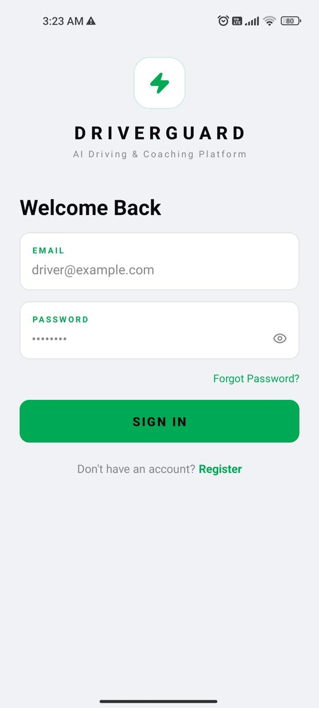
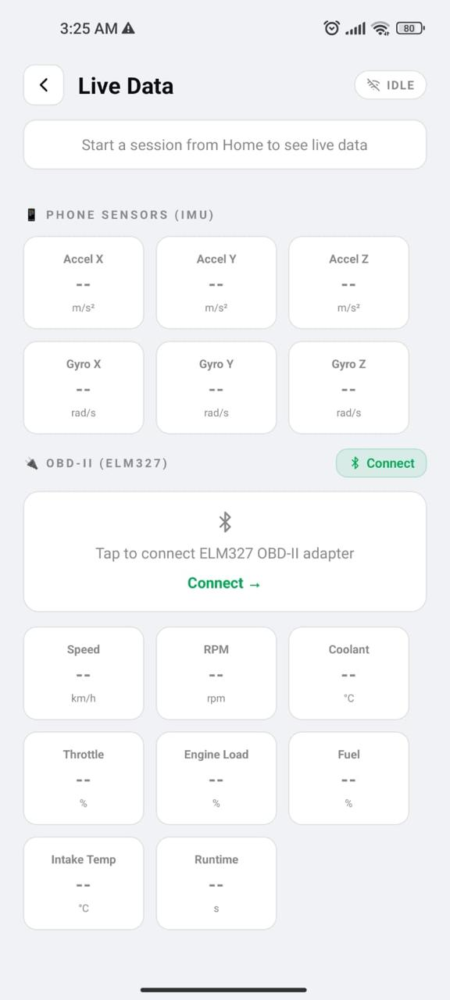
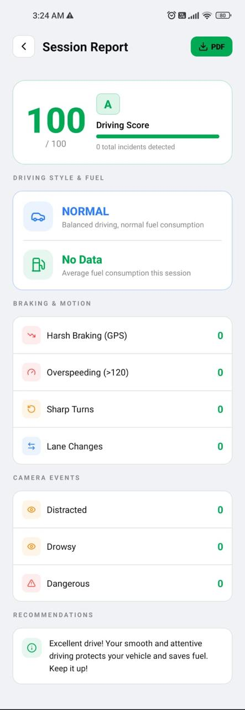

# DriverGuard App Screens Samples

<p align="center">
  
  
  
</p>
<h3 align="center">AI-Powered Driver Monitoring & Coaching Platform</h3>

DriverGuard is a mobile application designed to improve driving safety by combining **AI camera monitoring, phone sensors, GPS, and OBD-II vehicle data** to analyze driving behavior in real time.

## Features

- User authentication and driver profiles
- Real-time driving dashboard
- Camera-based driver monitoring with YOLO
- IMU-based event detection
- GPS speed and trip tracking
- OBD-II / ELM327 vehicle data
- Driving score and session history
- Driving-style analysis
- Fuel-consumption estimation
- Driving reports and recommendations

## AI Monitoring

The system detects:

```text
Safe Driving
Distracted Driving
Sleepy Driving
Dangerous Driving
```

It also identifies driving events such as:

```text
Harsh Braking
Sudden Acceleration
Turning
Lane Changes
```

## Technology Stack

**Frontend:** React Native, Expo, Expo Router  
**Backend:** Node.js, Express.js, MongoDB  
**AI:** Python, FastAPI, YOLO, PyTorch, scikit-learn  
**Vehicle:** OBD-II / ELM327  
**Sensors:** IMU, GPS, Camera, Bluetooth


### Mobile

```bash
cd driverguard-frontend
npm install
npx expo start
```

### Backend

```bash
cd driverguard-backend
npm install
npm run dev
```

### AI Server

```bash
cd driverguard-ai
pip install -r requirements.txt
uvicorn main:app --host 0.0.0.0 --port 8000
```

Update the API URLs in the frontend configuration to your computer's local IP when testing on a physical device.

## Project Structure

```text
DriverGuard/
├── driverguard-frontend/
├── driverguard-backend/
├── driverguard-ai/
└── README.md
```

## Future Improvements

- Cloud deployment
- Improved AI inference
- Fleet management
- Personalized recommendations
- Expanded vehicle compatibility

## License

Educational / Final Year Project.

<p align="center">
  <strong>DriverGuard — Drive safer. Drive smarter.</strong>
</p>
